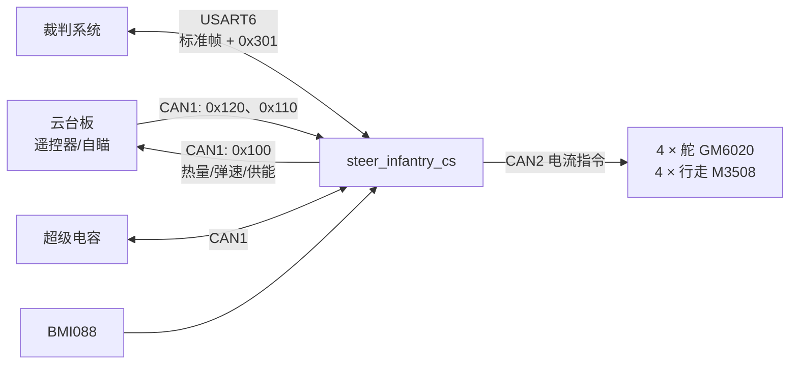
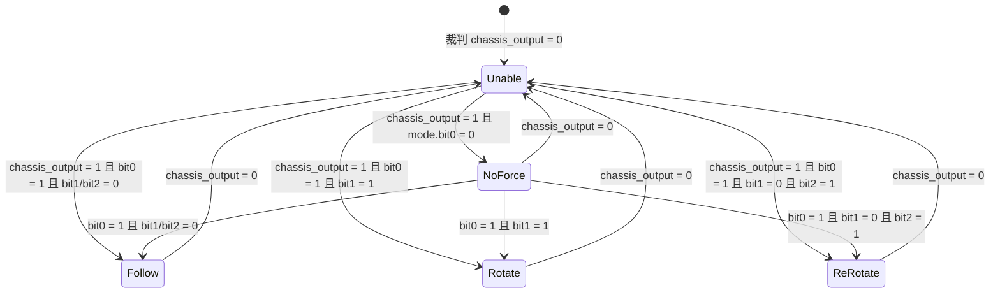

# steer_infantry_cs：舵轮步兵底盘板代码说明

`steer_infantry_cs` 是 RoboMaster 舵轮步兵的底盘控制板固件目标，运行在本仓库的 STM32F407/Board-C 工程中。它不直接接收 DR16：云台板负责遥控器、自瞄等上层输入，并经 CAN 将底盘速度、模式和 UI 状态下发；本 target 负责四舵轮闭环、裁判系统接入、超级电容功率约束，以及操作手 UI 的绘制和发送。

本文以当前 `target/steer_infantry_cs` 分支中的源码为准，旨在帮助接手者理解真实执行路径、接口和风险点，而非描述预期功能。

## 1. 构建入口与文件布局

本 target 在 [`app/CMakeLists.txt`](../../CMakeLists.txt) 中由 `add_exe_target(steer_infantry_cs, ...)` 注册；源文件通过 `targets/steer_infantry_cs/*.cc` 自动收集。构建时选择同名 CMake target：

```powershell
cmake --build <构建目录> --target steer_infantry_cs
```

目录内各文件的职责如下。

| 文件 | 职责 |
| --- | --- |
| `main.cc` / `main.hpp` | 应用入口、硬件实例化、500 Hz 主循环及分频任务、全局对象仓库 `globals` |
| `freemaster.hpp` | FreeMASTER 的全局 `volatile` 监视快照 `freemaster_data`，由 100 Hz 任务刷新 |
| `Chassis.cc` / `Chassis.hpp` | 底盘运行状态、遥控速度坐标变换、四舵轮控制调用、速度/功率限制 |
| `GimbalCommunicator.*` | 与云台板的 CAN 收发协议 |
| `Referee.*` | 裁判系统 UART 字节流接收并喂给 `Referee` 解包器 |
| `subReferee/protocol_user.hpp` | 裁判系统 `0x301` 自定义子协议、UI 图元和数据结构 |
| `subReferee/referee_user.hpp` | `0x301` 数据按子命令反序列化，以及 UI 帧封包 |
| `subReferee/TaskScheduler.hpp` | UI 静态/动态任务调度器 |
| `UI/UIInfantry.cc` | 自身状态、自瞄状态和底盘模式 UI |
| `UI/UIuser1.cc` | 对方机器人 HP、Buff、允许弹量、金币信息 UI（红蓝双方布局） |

公共四舵轮控制器位于 [`app/common/controllers/quad_steering_chassis.hpp`](../../common/controllers/quad_steering_chassis.hpp)。

## 2. 硬件与数据流

### 2.1 本板实例化的设备

| 接口/设备 | 用途 |
| --- | --- |
| CAN1 | 云台板通信 `GimbalCommunicator`、超级电容 `GkSupercap`、底部 Yaw GM6020（ID 4） |
| CAN2 | 四个舵电机 GM6020（ID 1/2/4/3）及四个行走 M3508（ID 1/2/4/3） |
| USART6 | 裁判系统 UART，`Serial<128>` 接收缓冲 |
| SPI1 + BMI088 | IMU 更新与 Mahony AHRS 姿态解算 |
| TIM13 | 主循环定时器 |
| TIM1 CH1 | 启动 PWM 输出（具体用途由板级配置决定） |



### 2.2 云台—底盘 CAN 协议

`GimbalCommunicator` 注册 CAN 标准帧 ID `0x110`、`0x120`，且向云台板发送 `0x100`。

| 方向与帧 | 字节/字段 | 含义 |
| --- | --- | --- |
| 云台 → 底盘 `0x120` | `data[0]`, `data[1]` | 有符号 8 位，除以 100 后为 `remote_speed_x/y` |
| 云台 → 底盘 `0x120` | `data[2]` | `chassis_mode` 位域，见状态机 |
| 云台 → 底盘 `0x120` | `data[3]` | `UI_show_flag` |
| 云台 → 底盘 `0x120` | `data[4]` bit0/bit1 | `get_target_flag` / `suggest_fire_flag` |
| 云台 → 底盘 `0x120` | `data[5]` | 有符号 `aim_speed_change` |
| 云台 → 底盘 `0x120` | `data[6..7]` | 第 1 个 HP（大端） |
| 云台 → 底盘 `0x110` | `data[0..7]` | 其余 4 个 HP（每项 16 位大端） |
| 底盘 → 云台 `0x100` | 0..3 | 当前热量、热量上限（均为 16 位大端） |
| 底盘 → 云台 `0x100` | 4 | 弹速压缩到区间 0–32 的 8 位值 |
| 底盘 → 云台 `0x100` | 5 | `power_state << 4` 与红蓝方标志（`robot_id < 100`） |

## 3. 启动和实时调度

`AppMain()` 先延时 100 ms，再创建 `GlobalWarehouse`、`Chassis` 并调用 `globals->Init()`。`Init()` 中完成 CAN、IMU、裁判系统、8 个底盘电机、蜂鸣器/LED、PID 参数及底盘控制器初始化。

随后 TIM13 被设置为 `84 MHz / 168 / 1000 = 500 Hz`，因此尽管局部变量名为 `mainloop_1000hz`，**实际 `MainLoop()` 周期为 2 ms、频率为 500 Hz**。每轮先递增 `globals->time`，再依次调用所有 SubLoop。

| 函数 | 触发条件 | 实际频率/职责 |
| --- | --- | --- |
| `SubLoop500Hz()` | 每轮 | BMI088 + Mahony AHRS、向云台回传裁判数据、更新超电、底盘控制、CAN2 电机指令发送 |
| `SubLoop250Hz()` | `time % 2 == 0` | 目前为空 |
| `SubLoop100Hz()` | `time % 5 == 0` | 更新 8 个底盘电机设备状态，并刷新 FreeMASTER 调试快照 |
| `SubLoop50Hz()` | `time % 10 == 0` | 更新 LED 图案和蜂鸣器频率 |
| `SubLoop10Hz()` | `time % 50 == 0` | 读取 robot ID；若允许则将 UI 任务加入调度器 |
| `SubLoop30Hz()` | `time % 34 == 0` | 调用一次 UI 调度器 |

### 重要：UI 调度频率与命名不一致

`time` 是 `uint8_t`，每 256 次主循环回绕。`time % 34 == 0` 在一个 256 tick 周期中只命中 8 次，因此 UI 调度器不是构造时声明的 30 Hz，而是平均约 `500 × 8 / 256 = 15.625 Hz`。`SubLoop30Hz` 只是名称，不是实际时序保证。

动态 UI 任务被配置为 2 Hz 或 10 Hz；调度器按累计额度选择任务，但累计时基是 15.625 Hz，故实际刷新率也会低于设定值。若要严格满足 UI 刷新频率，需要使用足够宽的计数器并按真实调度周期重新计算。

## 4. 状态机：真正可达的状态

`StateMachineType` 同时列举了底盘、Buff 和速度状态，包含 `kTest`、`kMatch` 等值；但当前底盘逻辑只会写入下表的状态。它们是 **三个并列状态变量**，不是枚举注释所暗示的层级状态机。



| 变量 | 判定来源 | 当前行为 |
| --- | --- | --- |
| `ChassisMove_` | 裁判 `power_management_chassis_output`、`chassis_mode` bit0/bit1/bit2 | `kUnable`：裁判断底盘电；`kNoForce`：云台未使能；`kFollow`：跟随；`kRotate`：正小陀螺；`kReRotate`：反小陀螺。bit1 优先于 bit2。 |
| `buff_state_` | `chassis_mode` bit4/bit5 | bit4 为 `kDaFu`，否则 bit5 为 `kXiaoFu`，否则 `kNormal`。仅 UI 显示，当前不改变控制量。 |
| `speed_mode_` | 超电能量、错误码、`high_speed_mode_flag`（bit3）、裁判 buffer 能量 | 满足能量 > 80、超电无错、bit3 为 1、buffer > 30 时为 `kHighSpeed`，否则普通速度。 |

`kTest`、`kMatch` 在此 target 中没有赋值路径；不要把它们当作现有可切换模式。`kUnable` 与 `kNoForce` 都关闭控制器并给八个电机置零，但语义不同：前者是裁判电源许可关闭，后者是云台未使能底盘。

## 5. 底盘控制流程

### 5.1 从遥控量到车体目标

在 `kFollow`、`kRotate` 或 `kReRotate` 时，`ChassisRCDataUpdate()` 执行：

1. 用底部 Yaw GM6020 编码器计算 `down_yaw_delta = front_down_yaw_angle - yaw`，再包裹到 `[-π, π]`。
2. 对云台下发的归一化遥控量设置 0.2 死区；通过 `remote_speed_y → x`、`remote_speed_x → y` 映射到 `±1800` 的目标量。
3. 用 `down_yaw_delta` 将平移量旋转到车体坐标。
4. 按模式生成角速度：
   - `kFollow`：环形 PID 使底盘 Yaw 相对前方角归零；若角速度输出超过 2000，按剩余转向裕度平方衰减平移。
   - `kRotate`：正向角偏置 `-0.15 rad`，角速度为 `+4000 × k_speed_limit`；平移较大时降到 `+2000 × k_speed_limit` 且平移减半。
   - `kReRotate`：采用相反角偏置和负角速度，逻辑与 `kRotate` 对称。
5. 对平移模长限为 10000，分别乘以 `k_speed_limit` 后再次限幅；角速度限为 `±30000`。

### 5.2 四舵轮闭环

`ChassisMovePIDUpdate()` 将 `(target_x, target_y, target_w)` 交给 `QuadSteeringChassis::SetTarget()`，再把四个舵电机相对零位的编码器值映射到角度，并输入舵/轮电机 RPM。

`QuadSteeringChassis::Update()` 的链路为：

```text
(vx, vy, w)
  -> SteeringChassis::Forward（每个模块的目标舵角与轮速）
  -> 舵角环形位置 PID -> 舵速度 PID -> 舵 GM6020 电流
  -> 轮速 PID -> 行走 M3508 电流
```

舵角 PID 设置为环形 `2π`；本 target 启用了默认的舵位置—速度串级。PID 参数在 `GlobalWarehouse::ChassisPIDInit()` 中集中设定：舵位置 `Kp=1000`、舵速度 `Kp=60`，轮速 `Kp=5, Kd=1`，电流限幅均为 6000 或 10000。

控制器还有一个抗舵抖分支：当任一轮 RPM 大于 50、平移目标为零且 `|w| < 2000` 时，舵角目标锁定当前角度；否则使用运动学解算目标。

> 注意：公共控制器注释将 `vx/vy/w` 标为 SI 速度，但本 target 传入的是 1800/4000/10000 量级的经验控制量，并用电机 RPM 作反馈。调参或移植前应先统一单位，不能直接把这些数值解释为 m/s、rad/s。

### 5.3 速度和功率限制

速度系数 `k_speed_limit` 由裁判功率上限和高速模式计算：

| 模式 | 系数公式 | 最终限幅 |
| --- | --- | --- |
| 正常 | `chassis_power_limit / 30 + 0.6` | `[0, 6]` |
| 高速 | `chassis_power_limit / 50 + 4.0` | `[0, 6]` |
| 未收到有效功率上限 | `2.0` | 无额外计算 |

电机输出还会统一乘以 `k_speed_power_limit_`：buffer 能量低于 20 时为 0；20–50 时为 `(buffer_energy / 60)^2`，且发给超电的裁判功率上限减半；至少 50 时为 1。该系数同时缩放舵电机和行走电机的电流，低 buffer 时底盘会完全失能。

## 6. 裁判系统与 UI

### 6.1 标准裁判数据和自定义子协议

`RxReferee` 在 UART 回调中逐字节执行 `*globals->referee_data << byte`。标准裁判数据提供：

- 底盘、云台供电许可；
- 底盘功率上限和 buffer 能量；
- 发射热量、热量上限和弹速；
- robot ID、红蓝阵营。

当裁判帧命令为 `0x301` 时，`RefereeUser::AttachCallback()` 从 `robot_interaction_data` 取 `data_cmd_id`，查 `RefereeSubProtocolMemoryMap`，将用户数据直接复制到对应子协议结构。这些结构包括敌方 HP、弹量许可、金币/RFID、Buff、位置及英雄—无人机协作数据。

UI 发送也走 `0x301`：`Referee0x301Prepare()` 负责填入 SOF、长度、序列号、CRC8、命令/子命令、发送方/接收方及 CRC16。每个图元以本机 `robotID` 为发送方、`robotID + 256` 为客户端接收方，并由 USART6 写出。

### 6.2 UI 初始化、调度与显示内容

`UiRefresh()` 每个 10 Hz 周期刷新 `robotID`。只有从云台板收到的 `UI_show_flag == 1` 时才调用 `static_UI_add()`。

调度器分两类任务：

- 静态任务：一次发送，后进先出。用于先 `Add` 图元/文本。
- 动态任务：按 `acc += task.freq` 的累计优先级选择一个任务运行，并扣除调度器频率。用于持续 `Edit` 已创建的图元。

当前注册的任务如下。

| 区域 | 初始化内容 | 动态更新 |
| --- | --- | --- |
| 中央/左右下方（`UIInfantry`） | 中心十字、两项数值、自瞄文本 `GETTARGET/SUGGESTFIRE`、模式文字 `F R N U D X / H N S`、状态指示矩形 | 超电能量（高速绿、普通红蓝）、瞄速调整（正绿/负粉/零白）、自瞄得到目标/建议开火、跟随/旋转/无力状态、大小符、速度模式及低 buffer 指示 |
| 上方红方布局（`UIuser1`） | `HRO1 ENG2 STD3 STD4 DRO6 SEN7` 标题、HP、金币、弹量字段 | 五类敌方 HP；防御 Buff ≥ 100 时 HP 变黄；敌方累计/剩余金币；敌方各单位可用弹量 |
| 上方蓝方布局（`UIuser1`） | 镜像顺序的 `SEN7 DRO6 STD4 STD3 ENG2 HRO1` 标题和字段 | 同一信息按蓝方屏幕坐标重排 |

红方 HP 从云台 CAN 收到的 `robot_hp_[5]` 读取；蓝方 HP 从裁判 `robot_custom_data_3.data` 的前 10 字节读取。两条数据链路不同，联调时应分别验证。

### 6.3 UI 触发风险

`static_UI_add()` 本身不清除 `UI_show_flag`。当该 flag 持续为 1 时，函数每 10 Hz 重复尝试加入同一批任务：动态任务因仍处于 scheduled 状态通常不会重复加入，但每个静态任务发送完会清除 scheduled 标记，后续会再次被加入。因此云台板应将它作为一次性脉冲，或底盘端改为边沿检测/完成确认；否则会反复发送 Add 图元，占用 UI 带宽。

## 7. 当前代码的上车前检查项

以下是从当前源码直接得出的检查项，不是已经修复的问题。

1. **裁判子协议构造顺序错误。** `GlobalWarehouse::Init()` 先执行 `subReferee = new RefereeUser(*referee_data)`，后才分配 `referee_data`。此时 `referee_data` 初始为 `nullptr`，解引用属于未定义行为，可能在启动阶段异常。应先构造 `referee_data`，再构造 `subReferee`、`RxReferee` 并绑定回调。
2. **主循环和 UI 时基不一致。** 变量名 `mainloop_1000hz` 与 `SubLoop30Hz` 均和实际频率不符；请以 TIM13 配置及 `uint8_t time` 回绕后的数学结果为准。
3. **`power_state` 目前由同一个 `power_management_gimbal_output` 位复制并左移组合。** 发给云台板的是该位的 `0` 或 `0b111`，不是三个独立的电源许可位。若协议期待独立的云台/发射/底盘状态，应核对字段来源。
4. **速度单位需要标定。** 当前四舵轮接口注释、目标量规模和 RPM 反馈并不处于同一显式物理单位体系；更换减速比、轮径或控制器时必须复核。
5. **四舵零位是硬编码。** `steer_wheel_init_encoder_ = {1114, 3111, 2912, 2274}`，以及前方 Yaw `4.5166 rad`、几何半径 `0.45368` 都与机械装配绑定。换车或重新装配后应重新标定。
6. **UI 数据依赖外部更新。** 未收到云台 CAN 或裁判 `0x301` 子协议时，HP/Buff/弹量会保留零初始化或旧值；显示层没有有效性/超时保护。

## 8. 推荐调试顺序

1. 先验证 `referee_data`、`subReferee` 的初始化顺序及串口解包，再依赖裁判功率数据使能底盘。
2. 抓 CAN1：确认云台的 `0x120` 中 bit0 能使能底盘，bit1/bit2 可切换三种运动模式，`remote_speed_x/y` 符号与实际一致。
3. 空载检查 CAN2 中四个舵角编码器零位和正反向，再闭环启用行走轮。
4. 观察 buffer 能量跨过 20、50 与超电能量跨过 80 时的电流、速度模式和 UI 是否符合预期。
5. 最后用一次性 `UI_show_flag` 触发 UI 初始化，检查静态 Add 后动态 Edit 的帧率与红蓝双方坐标。
